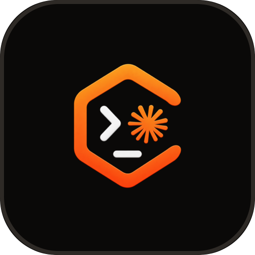
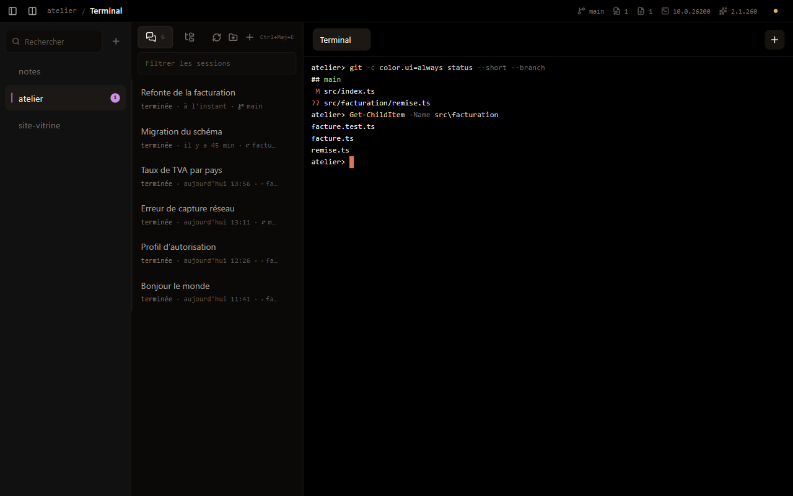
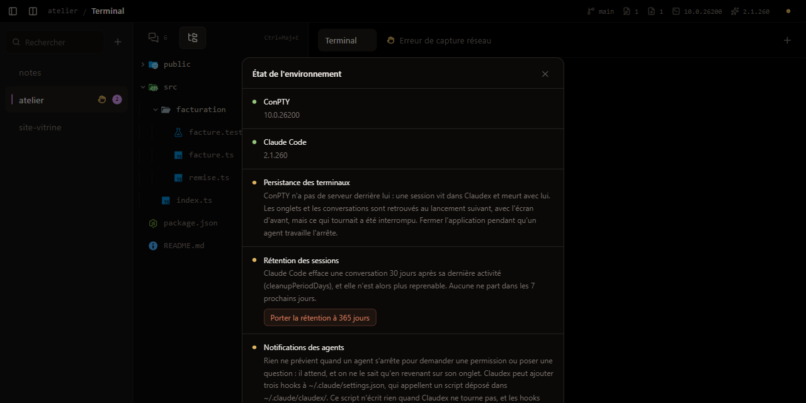

<div align="center">
    
    <h1>Claudex</h1>
</div>

Claudex est un IDE de bureau dont l'unité de base n'est pas le fichier, mais la conversation
d'agent. On ouvre un projet, on voit toutes les conversations Claude Code qui ont eu lieu dans
ce dossier, on en choisit une. Un terminal la reprend exactement là où elle s'était arrêtée,
même après un redémarrage de la machine.


[](https://github.com/lamine-f/claudex/releases/latest)

-fa4e49?style=flat-square)
[](LICENSE)

> [!NOTE]
> Claudex en est à sa première version publiée. Elle est utilisable au quotidien. Certaines
> fonctions restent à venir, la feuille de route plus bas dit lesquelles.

<details>
<summary>Sommaire</summary>

- [Installer](#installer)
- [Fonctions et feuille de route](#fonctions-et-feuille-de-route)
- [Raccourcis](#raccourcis)
- [Galerie](#galerie)
- [Comment ça tient debout](#comment-ça-tient-debout)
- [Les notifications, en détail](#les-notifications-en-détail)
- [Questions](#questions)
- [Développer](#développer)
- [Licence](#licence)

</details>

## Installer

Claudex ne remplace pas le CLI Claude Code, il l'orchestre. Il faut donc l'avoir installé et
connecté, quelle que soit la plateforme. Suivre la
[documentation officielle](https://docs.claude.com/en/docs/claude-code/setup), puis lancer
`claude` une fois dans un terminal pour s'authentifier.

### macOS

Les terminaux de Claudex sont des sessions tmux. C'est ce qui leur permet de survivre à la
fermeture de l'application.

```sh
brew install tmux
```

Sans [Homebrew](https://brew.sh), voir le [dépôt de tmux](https://github.com/tmux/tmux/wiki/Installing).

Prendre ensuite le DMG dans la
[dernière version publiée](https://github.com/lamine-f/claudex/releases/latest), l'ouvrir,
glisser Claudex dans le dossier Applications.

L'application n'est pas notarisée par Apple. Au premier lancement, macOS refusera de l'ouvrir
d'un double-clic. Faire **clic droit → Ouvrir**, puis confirmer. Une seule fois.

### Windows

Rien à installer en plus : les terminaux s'appuient sur ConPTY, qui fait partie de Windows.

Prendre l'installateur `.exe` dans la
[dernière version publiée](https://github.com/lamine-f/claudex/releases/latest). Il s'installe
pour l'utilisateur courant et ne demande pas de droits d'administrateur. L'application n'étant
pas signée, SmartScreen affichera un avertissement au premier lancement : **Informations
complémentaires → Exécuter quand même**.

> [!IMPORTANT]
> Sur Windows, un terminal ne survit pas à la fermeture de Claudex. ConPTY n'a pas de serveur
> derrière lui, là où tmux en a un : la session est le processus, et elle meurt avec
> l'application. Les onglets, les conversations et l'écran de chaque terminal sont retrouvés au
> lancement suivant, mais ce qui tournait a été interrompu. Fermer Claudex pendant qu'un agent
> travaille l'arrête. L'écran d'état le rappelle.

Si l'écran d'état annonce Claude Code introuvable alors qu'il est installé, c'est que
`%USERPROFILE%\.local\bin` n'est pas encore dans le PATH : son installateur ne l'y ajoute qu'à
la session Windows suivante. Claudex sait s'en passer pour ses propres terminaux, se
déconnecter puis se reconnecter règle le reste.

Les raccourcis prennent `Ctrl+Maj` au lieu de `⌘` : `Ctrl` seul appartient au shell, où
`Ctrl+E` va en fin de ligne et `Ctrl+W` efface le mot précédent.

### Debian et dérivées

```sh
sudo apt install tmux
```

Deux formats, au choix, dans les
[paquets Debian](https://github.com/lamine-f/claudex/releases/tag/v0.2.0-debian.1). Le paquet
Debian déclare tmux dans ses dépendances et l'installe avec l'application ; l'AppImage ne dépend
de rien et ne s'installe pas.

```sh
sudo apt install ./claudex_0.2.0_amd64.deb

# ou, sans installation
chmod +x Claudex-0.2.0.AppImage
./Claudex-0.2.0.AppImage
```

Ces paquets sont une avant-première : ils sont construits depuis la branche du portage, que
`main` n'a pas encore reprise. Ils se refabriquent depuis les sources avec `npm run dist:linux`,
et sortent dans `dist/`.

Vérifié sur Debian 13 (trixie), GNOME sous Wayland, x86-64. Rien n'y est propre à Debian : une
autre distribution récente devrait convenir, elle n'a simplement pas été essayée.

<details>
<summary>Si la fenêtre ne s'ouvre pas</summary>

Electron a besoin d'un bac à sable. Il le prend dans les espaces de noms utilisateur du noyau,
que les distributions récentes activent par défaut. Pour le vérifier :

```sh
cat /proc/sys/kernel/unprivileged_userns_clone   # doit répondre 1
```

Si la valeur est `0`, ou si AppArmor restreint ces espaces de noms
(`/proc/sys/kernel/apparmor_restrict_unprivileged_userns` à `1`, cas d'Ubuntu 24.04), l'ouvrir
à Claudex vaut mieux que de lancer l'application avec `--no-sandbox`, qui la désarme entièrement.

</details>

## Fonctions et feuille de route

### Conversations

- [x] Lister les conversations du dossier exact, comme `/resume`
- [x] Les reprendre en un clic, avec tout leur contexte
- [x] Bifurquer pour explorer une piste sans toucher à l'originale
- [x] Renommer, étiqueter, mettre en favori, écarter vers une corbeille
- [x] Rattacher une conversation lancée à la main dans un terminal
- [ ] Archiver les transcrits en gzip avant que Claude Code ne les efface

### Rangement

- [x] Déplacer les conversations à la souris
- [x] Les réunir en groupes nommés, et déplacer les groupes
- [x] Filtrer sur le titre
- [x] Retrouver le classement au lancement suivant

### Terminaux

- [x] Sessions tmux persistantes, sur un socket dédié (macOS)
- [x] Un onglet par conversation, plusieurs onglets par projet
- [x] Reprise après un redémarrage de la machine
- [ ] Terminaux persistants sur Windows
- [ ] Découper un onglet en plusieurs volets

### Notifications

- [x] Signaler l'agent qui demande une permission ou pose une question
- [x] Notification du système quand la fenêtre n'a pas le focus
- [x] Installer et retirer les hooks depuis l'application
- [ ] Distinguer un agent interrompu d'un agent qui a fini

### Projets et fichiers

- [x] Ajouter un projet, lui donner une couleur, passer de l'un à l'autre
- [x] Arborescence avec les icônes du type de fichier
- [x] Aperçu en lecture seule, coloré selon le langage
- [x] Écran d'état de l'environnement, avec ses correctifs
- [x] Windows
- [x] Linux, sur Debian

## Raccourcis

| macOS | Windows et Linux | |
|---|---|---|
| `⌘T` | `Ctrl+Maj+T` | nouveau terminal |
| `⌘W` | `Ctrl+Maj+W` | fermer l'onglet, et sa session avec lui |
| `⌘E` | `Ctrl+Maj+E` | basculer entre les conversations et les fichiers |
| `⌘1`…`⌘9` | `Ctrl+1`…`Ctrl+9` | passer d'un projet à l'autre |

La Majuscule n'est là que hors de macOS, où Commande est libre. Ailleurs il faut laisser
Contrôle au terminal : `Ctrl+E` va en fin de ligne, `Ctrl+W` efface le mot précédent, et une
application faite de terminaux ne peut pas les prendre à l'agent. Les chiffres s'en passent,
le shell ne les revendiquant pas.

## Galerie

Les captures sont prises sur macOS, sauf celles de la dernière section.

#### Les conversations d'un projet, et leurs états


Chaque ligne dit où elle en est. Celle qu'on a sous les yeux, celles qui patientent dans un
autre onglet. La branche git, la date, l'étiquette posée à la main, l'étoile des favoris qui
passent en tête.

#### Bifurquer une conversation


La nouvelle conversation repart du même contexte sous un nouvel identifiant. L'originale reste
intacte. Le nom donné est transmis à Claude Code, qui l'affichera dans son propre sélecteur.

#### Ranger les conversations en groupes


Tant qu'on n'a rien touché, la liste garde son ordre naturel. Dès qu'une conversation est
rangée, elle garde sa place, et celles qui apparaissent ensuite passent devant.

#### Tout faire au clic droit


Le menu fait le même travail que la souris, sans viser. C'est aussi le seul chemin au clavier.

#### Voir l'agent qui vous attend


Une main levée sur la conversation, sur son onglet et sur son projet. Hors de l'application,
une notification du système qui mène droit au bon onglet.

#### Parcourir les fichiers du projet


`⌘E` bascule la colonne sur l'arborescence. Les icônes suivent le type de fichier, les entrées
ignorées par git passent en retrait.

#### Lire un fichier sans quitter l'application


L'aperçu est en lecture seule, coloré selon le langage. Claudex ne prétend pas remplacer votre
éditeur. Il donne à lire, pas à écrire.

#### Vérifier l'installation


La pastille en haut à droite ouvre l'état de l'environnement. Ce qui peut être corrigé d'un
clic l'est depuis là.

#### Sur Windows

C'est la même application, et refaire la galerie entière ne montrerait que des jumelles. Deux
captures suffisent à dire ce qui change.



La barre de titre reste celle du système, et la bande du haut ne lui réserve donc plus de place
à gauche. Les raccourcis affichés passent en `Ctrl+Maj`.



L'écran d'état porte l'avertissement propre à ce portage : un terminal ne survit pas à la
fermeture de l'application.

## Comment ça tient debout

**Un pilote de terminal par plateforme.** Le reste de l'application ne connaît qu'une interface,
`src/main/services/multiplexeur/`, et ignore ce qu'il y a derrière.

Sur macOS, c'est **tmux, sur un socket dédié**. Toutes les commandes passent par
`tmux -L claudex`. Vos sessions personnelles ne sont ni touchées ni polluées. Un onglet vaut une
session tmux. Fermer l'application détache les clients, ce qui tournait tourne encore.

Sur Windows, c'est **ConPTY**, sans serveur derrière. La session est le processus, et elle meurt
avec l'application. C'est le seul endroit où la promesse de Claudex n'est pas tenue de la même
façon, et l'écran d'état le dit.

**Le dossier des transcrits.** Claude Code range les conversations d'un dossier dans
`~/.claude/projects/<chemin encodé>/`, où l'encodage remplace tout caractère non alphanumérique
par un tiret. Claudex ne l'emploie que dans ce sens, du projet vers le dossier. La
transformation n'est pas réversible.

**Les en-têtes, lus en flux.** Un transcrit peut peser plus de cent mégaoctets. La lecture
s'arrête dès qu'elle tient le titre, la branche et la date. Le plafond est de 200 lignes ou
256 Ko.

**Rien n'est effacé.** Écarter une conversation la déplace dans une corbeille propre à Claudex.
Le transcrit reste récupérable. L'écran d'état propose aussi de porter la rétention de Claude
Code à 365 jours. Par défaut, il efface les conversations au bout de 30, et elles ne sont alors
plus reprenables.

## Les notifications, en détail

Les activer ajoute trois hooks à `~/.claude/settings.json`. `Notification` allume le voyant,
`UserPromptSubmit` et `Stop` l'éteignent. Ils appellent un script déposé dans
`~/.claude/claudex/`. Une sauvegarde `.bak` est faite avant l'écriture, et vos propres hooks ne
sont pas touchés. Ils sont complétés, jamais remplacés.

Le script n'écrit rien quand Claudex ne tourne pas. Et l'application ne réagit qu'aux
conversations dont elle a l'onglet. Le hook est posé pour toute la machine, mais les terminaux
qu'elle ne connaît pas ne déclenchent rien.

Le même écran propose de les retirer. Le script est alors effacé et la configuration rendue à
son état d'origine.

## Questions

**Et Linux ?**
Rien ne s'y oppose : le pilote tmux y fonctionnerait tel quel, il manque une cible
d'empaquetage et quelqu'un pour l'éprouver.

**Est-ce que Claudex remplace Claude Code ?**
Non. Il faut le CLI installé et connecté. Claudex lui donne des projets, des onglets qui
survivent, et la mémoire de quelle conversation appartient à quel onglet.

**Mes conversations existantes sont-elles visibles ?**
Oui. Claudex lit ce que Claude Code a déjà écrit. Ajoutez un dossier où vous avez travaillé,
ses conversations apparaissent aussitôt.

**Que devient une session quand je ferme l'application ?**
Sur macOS, elle continue de tourner : les clients tmux se détachent, rien n'est tué. Sur
Windows, elle s'arrête — voir la section [Windows](#windows). Dans les deux cas, fermer un
onglet dans l'application ferme sa session pour de bon.

## Développer

Le code, la structure, les tests et l'empaquetage : voir [DEVELOPPEMENT.md](DEVELOPPEMENT.md).

## Licence

Claudex est disponible sous [licence MIT](LICENSE).
