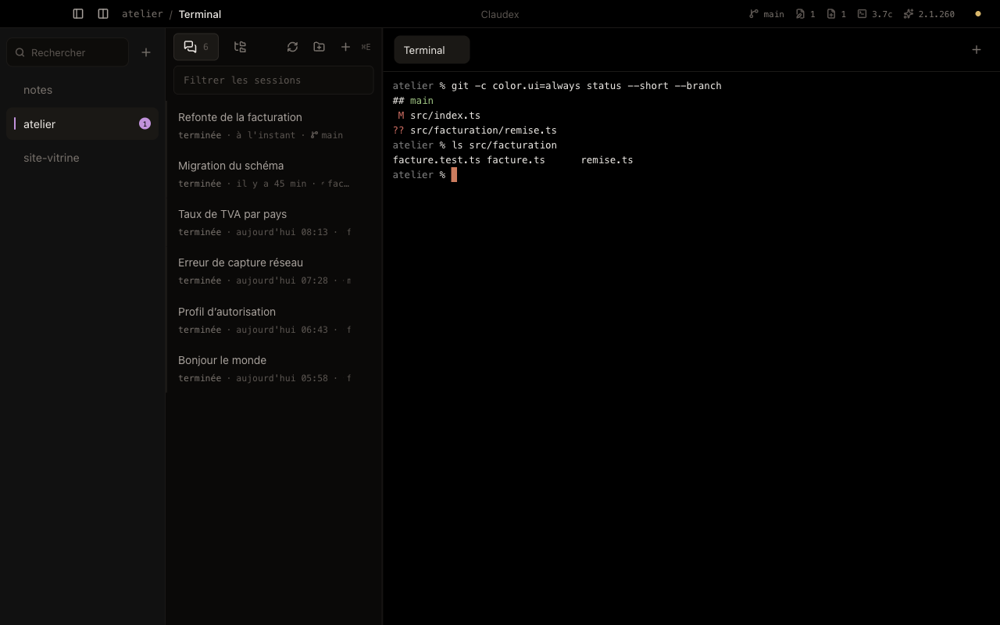
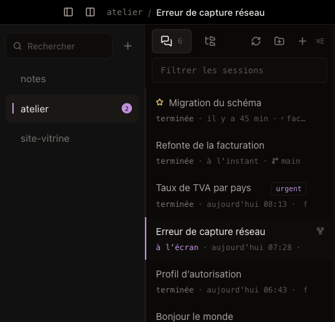
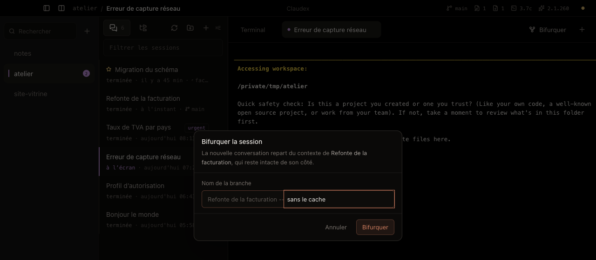
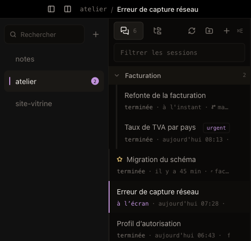
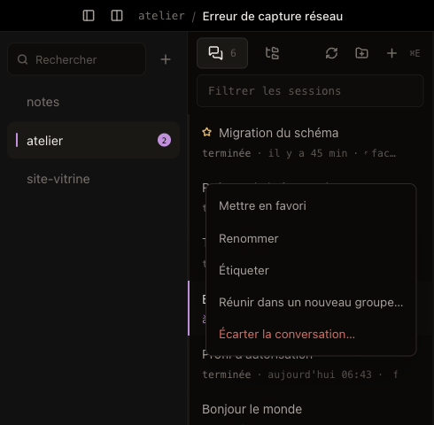
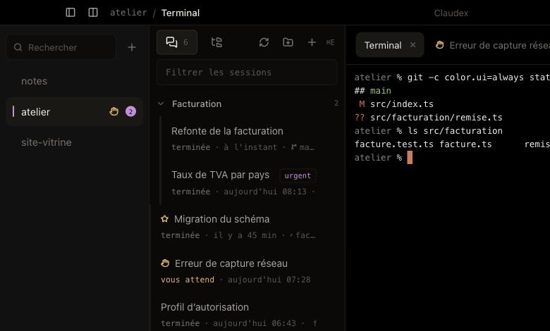
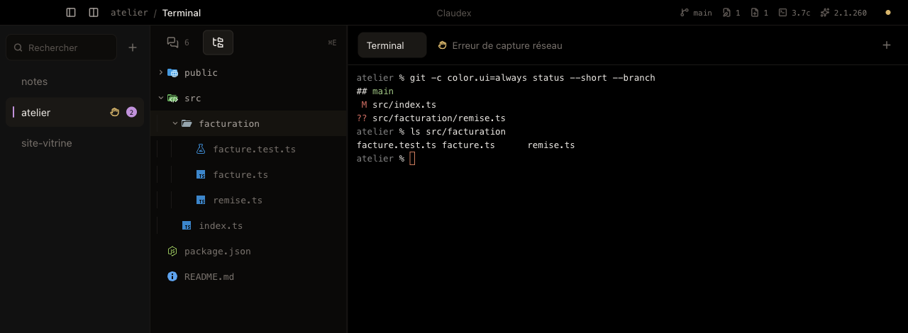
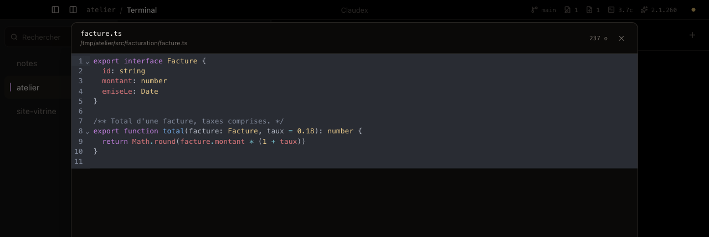
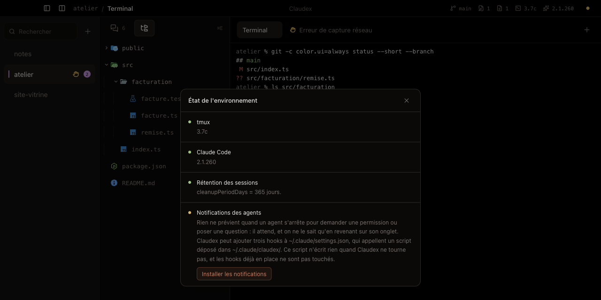

# Claudex

Un IDE de bureau dont l'unité de base n'est pas le fichier, mais la **conversation d'agent**.

On ouvre un projet, on voit toutes les conversations Claude Code qui ont eu lieu dans ce
dossier, on en choisit une : un terminal la reprend exactement là où elle s'était arrêtée.
Y compris après un redémarrage de la machine.



## Installer

**1. tmux.** Les terminaux de Claudex sont des sessions tmux : c'est ce qui leur permet de
survivre à la fermeture de l'application. Si vous avez [Homebrew](https://brew.sh) :

```sh
brew install tmux
```

Sinon, voir le [dépôt de tmux](https://github.com/tmux/tmux/wiki/Installing).

**2. Claude Code.** L'application ne remplace pas le CLI, elle l'orchestre — il faut donc
l'avoir installé et connecté. Suivre la
[documentation officielle](https://docs.claude.com/en/docs/claude-code/setup), puis lancer
`claude` une fois dans un terminal pour s'authentifier.

**3. Claudex.** Télécharger le DMG dans la
[dernière version publiée](https://github.com/lamine-f/claudex/releases/latest), l'ouvrir,
glisser Claudex dans Applications.

L'application n'est pas notarisée par Apple : au premier lancement, macOS refusera de
l'ouvrir d'un double-clic. Faire **clic droit → Ouvrir**, puis confirmer. Une seule fois.

> macOS sur Apple Silicon uniquement pour l'instant.

## Premiers pas

**Ajouter un projet.** Le `+` en haut de la colonne de gauche ouvre un sélecteur de dossier.
Un projet est un dossier de la machine, rien de plus : celui d'où vous lancez `claude`.

**Reprendre une conversation.** La colonne du milieu liste les conversations tenues dans ce
dossier exact — comme `/resume`, sans remonter celles des sous-dossiers. Un clic en ouvre une
dans un nouvel onglet, avec tout son contexte. Rien n'est jamais remplacé ; si elle est déjà
ouverte, on bascule sur son onglet.

Chaque ligne dit où elle en est — celle qu'on a sous les yeux, celles qui patientent dans un
autre onglet — avec sa branche git, sa date, l'étiquette qu'on lui a posée et l'étoile des
favoris, qui passent en tête.



**Bifurquer.** Sur une conversation, l'icône de branche repart du même contexte sous un
nouvel identifiant : deux pistes explorées en parallèle, l'originale intacte. Le nom que vous
donnez est transmis à Claude Code, qui l'affichera aussi dans son propre sélecteur.



**Ranger.** Les conversations se déplacent à la souris, se réunissent en groupes nommés, et
les groupes se déplacent aussi, leur contenu avec eux. Tant qu'on n'a rien touché, la liste
garde son ordre naturel ; dès qu'une conversation est rangée, elle garde sa place, et celles
qui apparaissent ensuite passent devant.



Le clic droit fait le même travail sans viser — et c'est le seul chemin au clavier.



**Être prévenu.** Quand un agent demande une permission ou pose une question, il s'arrête et
attend. Claudex peut le signaler : une main levée sur la conversation, sur son onglet et sur
son projet, plus une notification du système quand la fenêtre n'a pas le focus. À activer une
fois depuis l'écran d'état → *Installer les notifications*.
Voir [ce que cela ajoute](#les-notifications-en-detail) plus bas.



**Regarder les fichiers.** `⌘E` bascule la colonne sur l'arborescence du projet, avec les
icônes du type de fichier et les dossiers ignorés par git mis en retrait.



Un clic ouvre un aperçu en lecture seule, coloré selon le langage. Claudex ne prétend pas
remplacer votre éditeur : il donne à lire, pas à écrire.



**Vérifier l'installation.** La pastille en haut à droite ouvre l'état de l'environnement :
tmux, Claude Code, la rétention des conversations et les notifications. Ce qui peut être
corrigé d'un clic l'est depuis là.



**Raccourcis.**

| | |
|---|---|
| `⌘T` | nouveau terminal |
| `⌘W` | fermer l'onglet, et sa session tmux avec lui |
| `⌘E` | basculer entre les conversations et les fichiers |
| `⌘1`…`⌘9` | passer d'un projet à l'autre |

## Ce que ça change

Les terminaux modernes savent lister des sessions, mais ils ne connaissent pas la notion de
projet, et rien n'y survit vraiment à un redémarrage. Claude Code, lui, sait reprendre une
conversation — mais il ne sait pas laquelle appartient à quel onglet : son sélecteur oblige à
choisir à la main, à chaque terminal, à chaque fois.

Claudex mémorise l'association *onglet → conversation* et rejoue `claude -r <uuid>` tout seul.
C'est là qu'est la valeur, pas dans une liste de plus.

## Comment ça tient debout

**tmux, sur un socket dédié.** Toutes les commandes passent par `tmux -L claudex` : vos
sessions personnelles ne sont ni touchées ni polluées. Un onglet = une session tmux. Fermer
l'application détache les clients ; ce qui tournait tourne encore, et se retrouve au retour.

**Le dossier des transcrits.** Claude Code range les conversations d'un dossier dans
`~/.claude/projects/<chemin encodé>/`, où l'encodage remplace tout caractère non
alphanumérique par un tiret. Claudex ne l'emploie que dans ce sens — projet vers dossier —
jamais l'inverse, la transformation n'étant pas réversible.

**Les en-têtes, lus en flux.** Un transcrit peut peser plus de cent mégaoctets. La lecture
s'arrête dès qu'elle tient le titre, la branche et la date : plafond de 200 lignes ou 256 Ko.

**Rien n'est effacé.** Écarter une conversation la déplace dans une corbeille propre à
Claudex ; le transcrit reste récupérable. L'écran d'état propose aussi de porter la rétention
de Claude Code à 365 jours : par défaut, il efface les conversations au bout de 30, et elles
ne sont alors plus reprenables.

<a id="les-notifications-en-detail"></a>

## Les notifications, en détail

Les activer ajoute trois hooks à `~/.claude/settings.json` — `Notification` allume le voyant,
`UserPromptSubmit` et `Stop` l'éteignent — qui appellent un script déposé dans
`~/.claude/claudex/`. Une sauvegarde `.bak` est faite avant, et vos propres hooks ne sont pas
touchés : ils sont complétés, jamais remplacés.

Le script n'écrit rien quand Claudex ne tourne pas, et l'application ne réagit qu'aux
conversations dont elle a l'onglet : le hook est posé pour toute la machine, mais les
terminaux qu'elle ne connaît pas ne déclenchent rien.

Le même écran propose de les retirer, ce qui efface le script et rend la configuration à son
état d'origine.

## Développer

Le code, la structure, les tests et l'empaquetage : voir [DEVELOPPEMENT.md](DEVELOPPEMENT.md).

## Licence

MIT.
